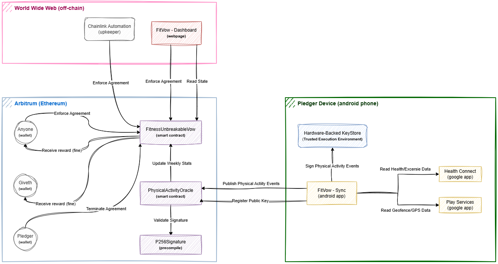

# FitVow

FitVow is a self-enforcing fitness vow built on-chain. You stake funds, commit to weekly activity goals, and let the contract enforce the rules without a trusted referee. Miss a week, pay a penalty. Keep your word, get your stake back.

**Live dashboard**: http://fitvow.pedroaugusto.dev/ (shows the current state of the challenge)

**Sandbox version**: http://fitvow.pedroaugusto.dev/sandbox (deployed in the Sepolia testnet)

**Article about this project**: https://pedrooaugusto.github.io/blog/posts/making-missed-workouts-cost-money-with-smart-contracts/

## Current challenge parameters
- Duration: 12 weeks.
- Total staked amount: ~235 USD / ~1200 BRL / 0.075 ETH.
- Blockchain: Arbitrum

## What it is
- A fitness commitment contract that escrows funds and penalizes missed weeks.
- An oracle that validates signed activity records and updates weekly status.
- A mobile app that collects data from Health Connect and geofences, then signs it with hardware-backed keys.
- A public enforcement model that routes penalties to charity and optional enforcers.

## How it works
1. A Pledger deploys `FitnessUnbreakableVow` with a stake in native ETH (or the chain's native token).
2. The FitVow Sync Android app collects running, sleep, and gym visit events and signs them on-device.
3. `PhysicalActivityOracle` verifies P-256 signatures (RIP-7212), validates the events, and aggregates weekly stats.
4. The vow contract receives weekly stats and tracks whether the Pledger met the goals.
5. If a week is missed, anyone can call `enforceAgreement()` to apply the penalty.
6. At the end of the term (plus grace), remaining funds are released back to the Pledger.

## Weekly goals (on-chain)
Goals are hard-coded in the contracts to keep rules immutable and auditable.

- Running sessions: minimum 2 km, pace cap, and minimum average BPM.
- Sleep sessions: minimum 7 hours and a healthy BPM band.
- Gym visits: geofenced location, minimum visit duration, and heart-rate thresholds.
- The Pledger must hit at least 2 of the 3 goals each week.
- Weekly counts and validators live in `contracts/lib/WeeklyGoalListable.sol` and `contracts/lib/PhysicalActivityValidator.sol`.

## Enforcement and penalties
- Penalty per missed week is `STAKED_AMOUNT / number_of_weeks`.
- If a regular user enforces, the penalty is split 50/50 between the caller and the [Giveth Charity](https://giveth.io/project/Giveth-Matching-Pool-0?tab=donations).
- If Chainlink Automation enforces, 100 percent goes to Giveth.
- [Giveth Charity Wallet](https://giveth.io/project/Giveth-Matching-Pool-0?tab=donations): `0x6e8873085530406995170Da467010565968C7C62`.

## Trust and integrity model
- Records are signed with a hardware-backed P-256 key stored in Android Keystore.
- The oracle stores Android Key Attestation metadata on-chain for external verification.
- Public key is set once; one-time-emergency rotation costs 35 percent of the vow balance and goes to Giveth.
- The Android app is built with a sign-and-forget flow to prevent silent APK replacement.

## Core contracts
- `contracts/FitnessUnbreakableVow.sol`: escrows stake, enforces weekly penalties, releases funds.
- `contracts/PhysicalActivityOracle.sol`: verifies signatures, validates activity, publishes weekly stats.
- `contracts/TheDoctor.sol`: time schedule and week index logic (active, grace, fully expired).

## Repository layout
- `contracts/`: Solidity contracts and libraries.
- `@androidapp/`: FitVow Sync Android app.
- `@website/`: Web dashboard (Vite + React).
- `@contract-event-store/`: Optional Lambda that mirrors contract events to S3 for the UI.
- `scripts/`: deployment helpers, key tools, and utilities.
- `run.sh`: build, deploy, enforce, and tooling shortcuts.

## Local development
```bash
npm install
npm run start
```

Build contracts:
```bash
./run.sh build-prod localhost
```

Deploy locally to hardhat:
```bash
./run.sh deploy localhost
```

Start the frontend:
(if you get timey wimey error wait a few minutes...)
```bash
cd @website
npm install
npm run dev
```

Publish fake physical activity events:
```bash
./run.sh push-record localhost --d 4000 --s 3 --g 3
```

Enforce a missed week:
```bash
./run.sh enforce localhost
```

## Notes
- Local settings use short weeks for testing (see `hardhat.config.ts` and `scripts/timing.ts`).
- Deployment addresses are tracked in `contracts/.addresses` and copied into the web and Android apps.
- This project is experimental and has not been audited.

## Diagram


## License
GPL-3.0-only. See `LICENSE`.
